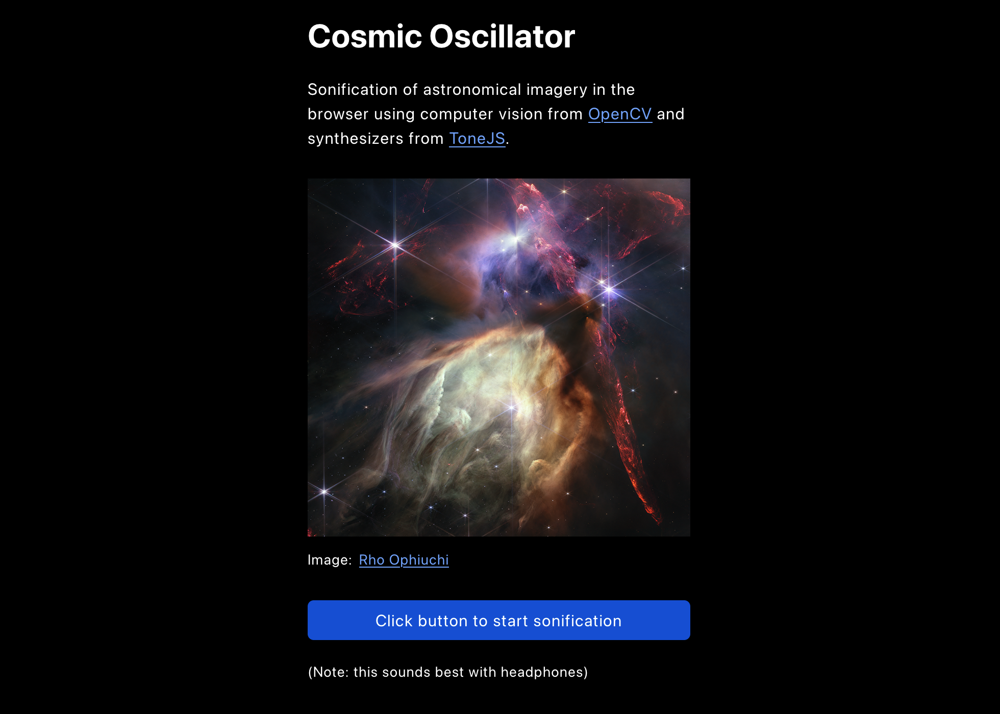

# Cosmic Oscillator

This web application creates a [sonification of astronomical imagery](https://science.nasa.gov/mission/hubble/multimedia/sonifications) in the browser using computer vision from [OpenCV](https://opencv.org/) and synthesizers from [ToneJS](https://tonejs.github.io/). It was created over the course of roughly 24 hours by [James Cole](https://www.linkedin.com/in/jcoledesign/) for the [2023 NASA Space Apps Challenge](https://www.spaceappschallenge.org/2023/find-a-team/oscillate/?tab=project).

### Click the link below to try it out:  
[https://jamescoledesign.github.io/cosmic-oscillator/](https://jamescoledesign.github.io/cosmic-oscillator/)  

This could be enhanced to include a way for people to generate sonifications by using a URL or uploading an image of their own. 

An [image of Rho Ophiuchi](https://webbtelescope.org/contents/media/images/2023/128/01H449193V5Q4Q6GFBKXAZ3S03) captured by the James Webb Space Telescope was processed in a Jupyter Notebook, primarily by using Python and OpenCV to calculate every RGB pixel value of the image. These RGB values were exported to JSON format and then consumed by the React application to control frequency parameters of virtual synthesizers created with ToneJS.

## Available Scripts

In the project directory, you can run:

### `npm start`

Runs the app in the development mode.\
Open [http://localhost:3000](http://localhost:3000) to view it in your browser.

### `npm test`

Launches the test runner in the interactive watch mode.\

### `npm run build`

Builds the app for production to the `build` folder.\
It correctly bundles React in production mode and optimizes the build for the best performance.

The build is minified and the filenames include the hashes.\
Your app is ready to be deployed!